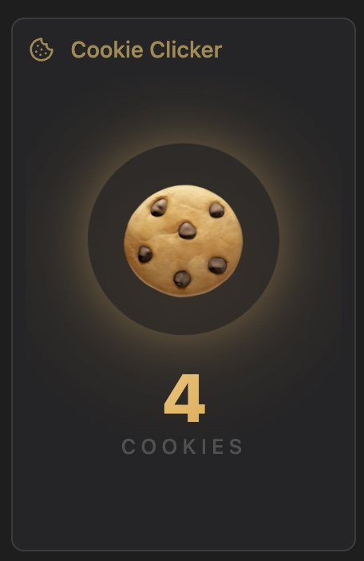
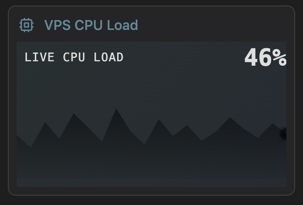

<div align="center">

# Hypane

**AI-powered personal dashboard. Create and manage panels through natural language chat.**

[](https://python.org)
[](https://fastapi.tiangolo.com)
[](https://mongodb.com)
[](https://htmx.org)
[](https://alpinejs.dev)
[](https://tailwindcss.com)
[](https://docker.com)
[](LICENSE)

[English](README.md) | [中文](README_zh.md)


</div>

## Features

- **Chat-driven** — Describe what you want, the AI agent creates panels with templates, handlers, and data
- **Panel system** — Drag-and-drop tiles on a 12-column grid (GridStack), resizable, per-dashboard layout
- **Multi-dashboard** — Multiple dashboards with a sidebar drawer to organize and reuse panels
- **Scheduled tasks** — Cron-based background jobs that update panel data (APScheduler)
- **Panel market** — Install pre-built panel templates with one click
- **Dark theme** — Obsidian-inspired Kabadoni theme with CSS custom properties

## Panel Examples

| Weather | Poster | Cookie Clicker | VPS CPU Load |
|---------|--------|----------------|--------------|
|  |  |  |  |

## Resource Console

Manage all panels, storages, and tasks in one place. Click to filter and inspect relationships.


## Architecture

```
┌─────────────────────────────────────────────────────────────┐
│                        Dashboard                            │
│  ┌─────────┐ ┌─────────┐ ┌─────────┐                       │
│  │ Panel A │ │ Panel B │ │ Panel C │  ← position & size    │
│  └────┬────┘ └────┬────┘ └────┬────┘    per dashboard      │
│       │           │           │                             │
└───────┼───────────┼───────────┼─────────────────────────────┘
        │           │           │
        ▼           ▼           ▼
   ┌─────────┐ ┌─────────┐ ┌─────────┐
   │ Storage │ │ Storage │ │ Storage │   ← shared JSON data
   │   "s1"  │ │   "s2"  │ │   "s3"  │     containers
   └─────────┘ └────┬────┘ └─────────┘
                     │
                     ▲
                ┌────┴────┐
                │  Task   │   ← cron job writes to
                │ (cron)  │     the same storage
                └─────────┘
```

- **Panel** — Self-contained tile with a Jinja2 template and optional Python handler. Panels reference storages by ID. The same panel can appear on multiple dashboards (shared data, independent layout).
- **Storage** — Shared JSON data container. Multiple panels and tasks can read/write the same storage, enabling real-time data flow.
- **Task** — Cron-scheduled background job (APScheduler). Tasks write to storages, and panels that reference those storages automatically reflect the latest data on render.

> Example: A "Weather" task runs every 30 minutes, fetches forecast data, and writes it to storage `weather-sg`. The "Singapore Weather" panel references the same storage and renders the data as a card. No direct coupling between task and panel — storage is the glue.

## Tech Stack

| Layer | Tech |
|-------|------|
| Backend | Python 3.12+ / FastAPI / Jinja2 |
| Database | MongoDB (Motor async driver) |
| Frontend | HTMX / Alpine.js / GridStack / Tailwind CSS 4 |
| Agent | [Pi](https://github.com/mariozechner/pi-coding-agent) coding agent (subprocess) |
| Build | Vite / uv / Docker |

## Quick Start

### Docker (recommended)

```bash
cp .env.example .env
# Edit .env — set your API key (Anthropic, OpenAI, Gemini, or OpenRouter)

docker compose up -d
# Open http://localhost:8000
```

### Local Development

```bash
# Prerequisites: Python 3.12+, Node.js 20+, MongoDB running locally

# Backend
uv sync
uv run uvicorn app.main:app --reload

# Frontend (separate terminal)
cd frontend && npm install && npm run build
```

Tailwind CSS is compiled via Vite, not CDN. Rebuild frontend after adding new utility classes.

## Environment Variables

See [`.env.example`](.env.example) for the full list. Key variables:

| Variable | Description |
|----------|-------------|
| `PI_PROVIDER` | LLM provider: `anthropic`, `openai`, `gemini`, `openrouter`, or `custom` |
| `PI_MODEL` | Model name (e.g., `claude-sonnet-4-20250514`) |
| `ANTHROPIC_API_KEY` | API key for your chosen provider |
| `MONGO_DSN` | MongoDB connection string (auto-configured in Docker) |

## Star History

[](https://star-history.com/#CallMeMhz/hypane&Date)

## License

MIT
