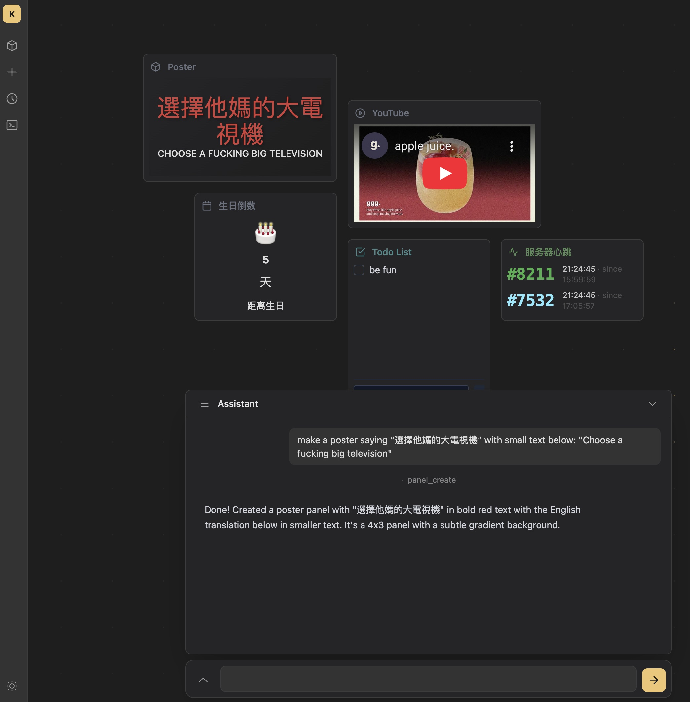

# Hypane

AI-powered personal dashboard. Create and manage panels through natural language chat.



## Features

- **Chat-driven** - Describe what you want, the AI agent creates panels with templates, handlers, and data
- **Panel system** - Drag-and-drop tiles on a 12-column grid (GridStack), resizable, per-dashboard layout
- **Multi-dashboard** - Multiple dashboards with a sidebar drawer to organize and reuse panels
- **Scheduled tasks** - Cron-based background jobs that update panel data (APScheduler)
- **Panel market** - Install pre-built panel templates with one click
- **Dark theme** - Obsidian-inspired Kabadoni theme with CSS custom properties

## Tech Stack

| Layer | Tech |
|-------|------|
| Backend | Python 3.12+ / FastAPI / Jinja2 |
| Database | MongoDB (Motor async driver) |
| Frontend | HTMX / Alpine.js / GridStack / Tailwind CSS 4 |
| Agent | [Pi](https://github.com/mariozechner/pi-coding-agent) coding agent (subprocess) |
| Build | Vite / uv / Docker |

## Quick Start

### Docker (recommended)

```bash
cp .env.example .env
# Edit .env — set your API key (Anthropic, OpenAI, Gemini, or OpenRouter)

docker compose up -d
# Open http://localhost:8000
```

### Local Development

```bash
# Prerequisites: Python 3.12+, Node.js 20+, MongoDB running locally

# Backend
uv sync
uv run uvicorn app.main:app --reload

# Frontend (separate terminal)
cd frontend && npm install && npm run build
```

Tailwind CSS is compiled via Vite, not CDN. Rebuild frontend after adding new utility classes.

## How It Works

Each panel is a self-contained unit stored in MongoDB:

- **Template** - Jinja2 HTML rendered with storage context (the panel's visual face)
- **Handler** - Optional Python module with `on_action(action, payload, storage)` for interactivity
- **Storage** - Shared JSON data containers referenced by ID; panels and tasks can share the same storage

Dashboards hold references to panels with per-dashboard position and size. The same panel can appear on multiple dashboards.

The AI agent (Pi) receives system context about existing panels, storages, and dashboard state, then uses tools (`panel_create`, `storage_update`, `task_create`, etc.) to build panels on your behalf.

## Environment Variables

See [`.env.example`](.env.example) for the full list. Key variables:

| Variable | Description |
|----------|-------------|
| `PI_PROVIDER` | LLM provider: `anthropic`, `openai`, `gemini`, `openrouter`, or `custom` |
| `PI_MODEL` | Model name (e.g., `claude-sonnet-4-20250514`) |
| `ANTHROPIC_API_KEY` | API key for your chosen provider |
| `MONGO_DSN` | MongoDB connection string (auto-configured in Docker) |

## License

MIT
