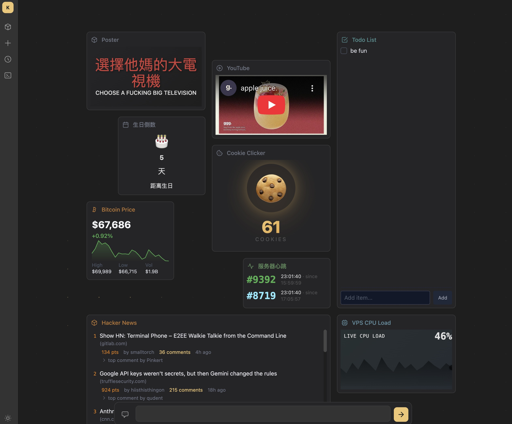
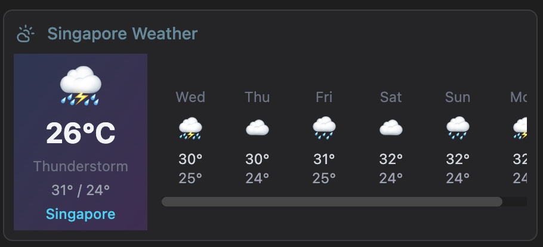
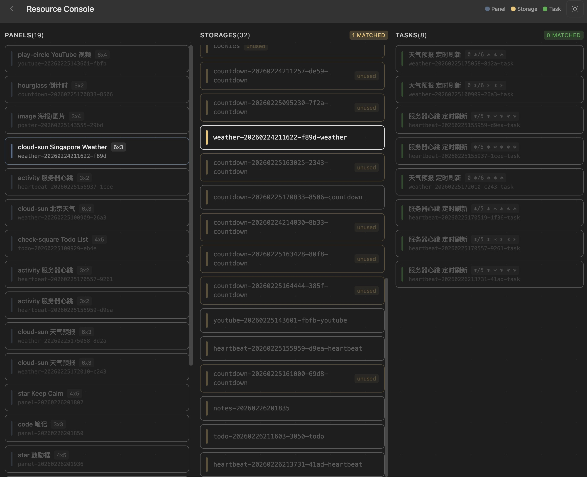

<div align="center">

# Hypane

**AI 驱动的个人仪表盘。通过自然语言对话创建和管理面板。**

[](https://python.org)
[](https://fastapi.tiangolo.com)
[](https://mongodb.com)
[](https://htmx.org)
[](https://alpinejs.dev)
[](https://tailwindcss.com)
[](https://docker.com)
[](LICENSE)

[English](README.md) | [中文](README_zh.md)



</div>

## 特性

- **对话驱动** — 描述你想要的内容，AI agent 自动创建面板（模板、处理器、数据）
- **面板系统** — 12 列网格拖拽布局（GridStack），可调整大小，每个仪表盘独立排版
- **多仪表盘** — 支持多个仪表盘，侧栏抽屉管理和复用面板
- **定时任务** — 基于 Cron 的后台任务自动更新面板数据（APScheduler）
- **面板市场** — 一键安装预制面板模板
- **暗色主题** — Obsidian 风格的 Kabadoni 主题，基于 CSS 自定义属性

## 面板示例

| 天气 | 海报 | 资源控制台 |
|------|------|-----------|
|  |  |  |

## 架构

```
┌─────────────────────────────────────────────────────────────┐
│                        Dashboard                            │
│  ┌─────────┐ ┌─────────┐ ┌─────────┐                       │
│  │ Panel A │ │ Panel B │ │ Panel C │  ← 位置和尺寸         │
│  └────┬────┘ └────┬────┘ └────┬────┘    按仪表盘独立存储   │
│       │           │           │                             │
└───────┼───────────┼───────────┼─────────────────────────────┘
        │           │           │
        ▼           ▼           ▼
   ┌─────────┐ ┌─────────┐ ┌─────────┐
   │ Storage │ │ Storage │ │ Storage │   ← 共享 JSON
   │   "s1"  │ │   "s2"  │ │   "s3"  │     数据容器
   └─────────┘ └────┬────┘ └─────────┘
                     │
                     ▲
                ┌────┴────┐
                │  Task   │   ← 定时任务写入
                │ (cron)  │     同一个 storage
                └─────────┘
```

- **Panel（面板）** — 自包含的磁贴，包含 Jinja2 模板和可选的 Python 处理器。面板通过 ID 引用 storage。同一个面板可以出现在多个仪表盘上（数据共享，布局独立）。
- **Storage（存储）** — 共享的 JSON 数据容器。多个面板和任务可以读写同一个 storage，实现实时数据流。
- **Task（任务）** — Cron 调度的后台任务（APScheduler）。任务向 storage 写入数据，引用该 storage 的面板在渲染时自动获取最新数据。

> 示例：一个「天气」任务每 30 分钟运行一次，获取天气预报数据并写入 storage `weather-sg`。「新加坡天气」面板引用同一个 storage，将数据渲染为卡片。任务和面板之间没有直接耦合 — storage 是连接它们的桥梁。

## 技术栈

| 层级 | 技术 |
|------|------|
| 后端 | Python 3.12+ / FastAPI / Jinja2 |
| 数据库 | MongoDB（Motor 异步驱动） |
| 前端 | HTMX / Alpine.js / GridStack / Tailwind CSS 4 |
| Agent | [Pi](https://github.com/mariozechner/pi-coding-agent) 编程 agent（子进程） |
| 构建 | Vite / uv / Docker |

## 快速开始

### Docker（推荐）

```bash
cp .env.example .env
# 编辑 .env — 设置 API Key（支持 Anthropic、OpenAI、Gemini 或 OpenRouter）

docker compose up -d
# 打开 http://localhost:8000
```

### 本地开发

```bash
# 前置条件：Python 3.12+、Node.js 20+、本地运行 MongoDB

# 后端
uv sync
uv run uvicorn app.main:app --reload

# 前端（另开终端）
cd frontend && npm install && npm run build
```

Tailwind CSS 通过 Vite 编译，不使用 CDN。添加新的 Tailwind 工具类后需要重新构建前端。

## 环境变量

完整列表见 [`.env.example`](.env.example)。主要变量：

| 变量 | 说明 |
|------|------|
| `PI_PROVIDER` | LLM 提供商：`anthropic`、`openai`、`gemini`、`openrouter` 或 `custom` |
| `PI_MODEL` | 模型名称（如 `claude-sonnet-4-20250514`） |
| `ANTHROPIC_API_KEY` | 对应提供商的 API Key |
| `MONGO_DSN` | MongoDB 连接字符串（Docker 中自动配置） |

## Star History

[](https://star-history.com/#CallMeMhz/hypane&Date)

## 许可证

MIT
